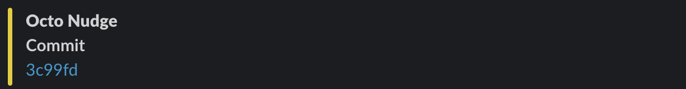

tos
# About

Octo Nudge is a Github Action that integrates with Slack and Discord and sends notifications to selected channels about you workflow. If your workflofw fails, or succeeds and you want to know about it, Octo Nudge will send a notificatio. Also, you can choose which events to listen to, and those are `push` and `schedule`.

# Action input arguments

The following table documents action input arguments:

| Input         | Required | Possible values      | Default          | Description                                                                           |
| ------------- | -------- | -------------------- | ---------------- | ------------------------------------------------------------------------------------- |
| webhooks      | yes      |                      |                  | A comma separated list of Slack/Discord webhooks to which to send the nudge           |
| events        | no       | 'push,schedule'      | 'push,schedule'  | A comma separated list of workflow run events you want to listen to and react to      |
| conclusions   | no       | 'failure,success'    | 'failure'        | A comma separated list of workflow run conclusions you want to listen to and react to |
| nudge-blocks  | no       | 'commit,message'     | 'commit,message' | A comma separated list of blocks you want to see in the nudge message                 |
| success-color | no       | any valid hex code   | '#228c22'        | Hex value of the color for successfull workflow run conclusions                       |
| failure-color | no       | any valid hex code   | '#990f02'        | Hex value of the color for failed workflow run conclusions                            |
# Quick usage

Here is a quick usage example of the action:

```
name: Nudge

on:
  workflow_run:
    workflows: [CI]
    types: [completed]
    branches: [main]

jobs:
  test:
    runs-on: ubuntu-latest
    environment: protected
    steps:
      - name: Send message
        uses: pavlovic-ivan/octo-nudge@main
        with:
          webhooks: ${{ secrets.WEBHOOKS }}
```

> **:information_source: NOTE:**
> Create a protected environment with webhooks as secrets. It is not suggested to commit webhooks in freetext to the repository

With the Octo Nudge configured as above (using defaults), Octo Nudge will listen to completed workflows runs by the name "CI", that got triggered by the main branch, either via push or by a scheduled run. Furthermore, Octo Nudge will check only if the workflow "CI" failed, and it will send a notification that contains two blocks: a commit, and a message with workflow info.

# Configuring Octo Nudge

To configure the Octo Nudge to behave you want it to behave, make sure you've read the [input arguments table](#action-input-arguments). Let's say you want the Octo Nudge to send notifications only when:

- a push triggers the "CI" workflow
- "CI" workflow fails or succeeds
- you want to see only the commit that triggered the "CI" workflow
- if the "CI" workflow fails you want to color the notification in yellow (#e6cc00)
- if the "CI" workflow succeeds you want to color the notification in blue (#0066ff)

```
name: Nudge

on:
  workflow_run:
    workflows: [CI]
    types: [completed]
    branches: [main]

jobs:
  test:
    runs-on: ubuntu-latest
    environment: protected
    steps:
      - name: Send message
        uses: pavlovic-ivan/octo-nudge@main
        with:
          webhooks: ${{ secrets.WEBHOOKS }}
          events: 'push'
          conclusions: 'failure,success'
          nudge-blocks: 'commit'
          success-color: '#e6cc00'
          failure-color: '#0066ff'
```

Here is the success nudge:

Here is the failure nudge:

